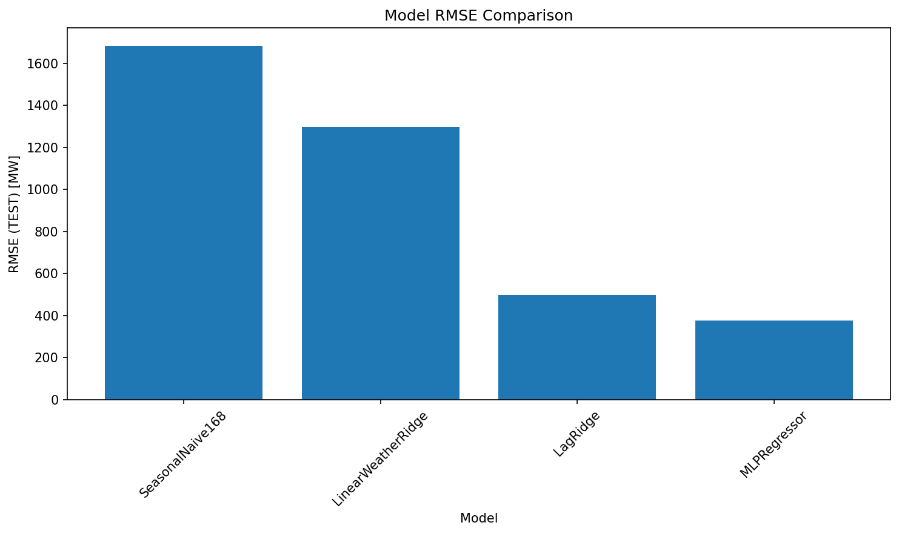
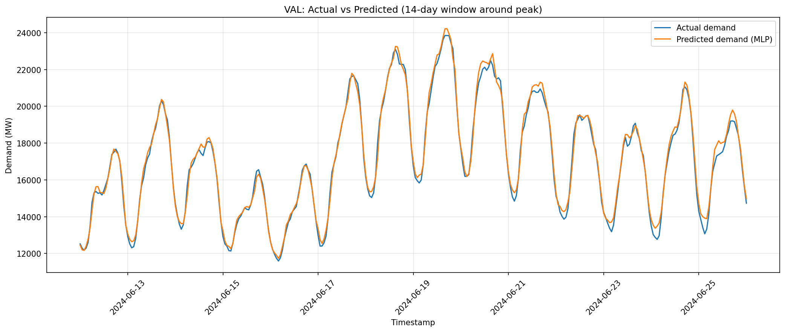
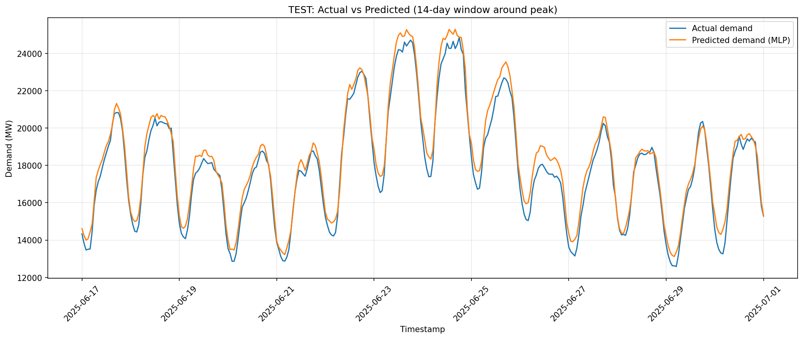
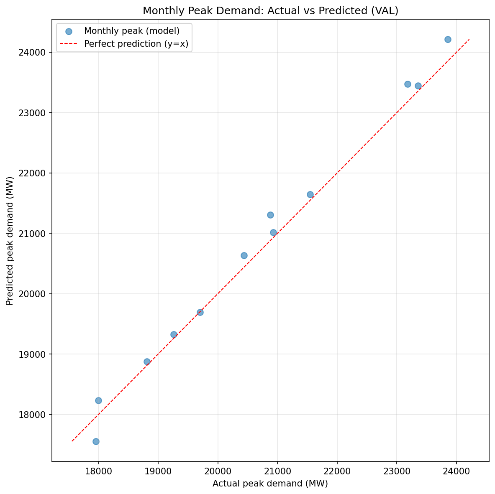
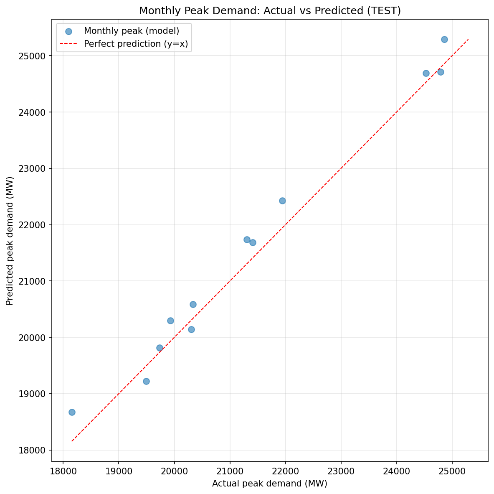
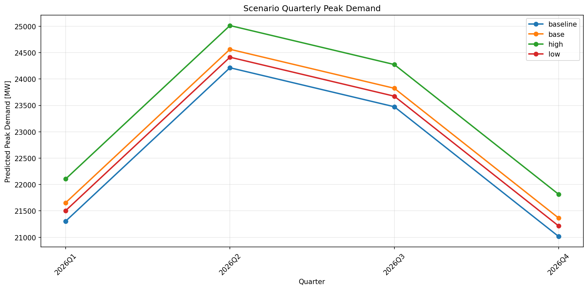
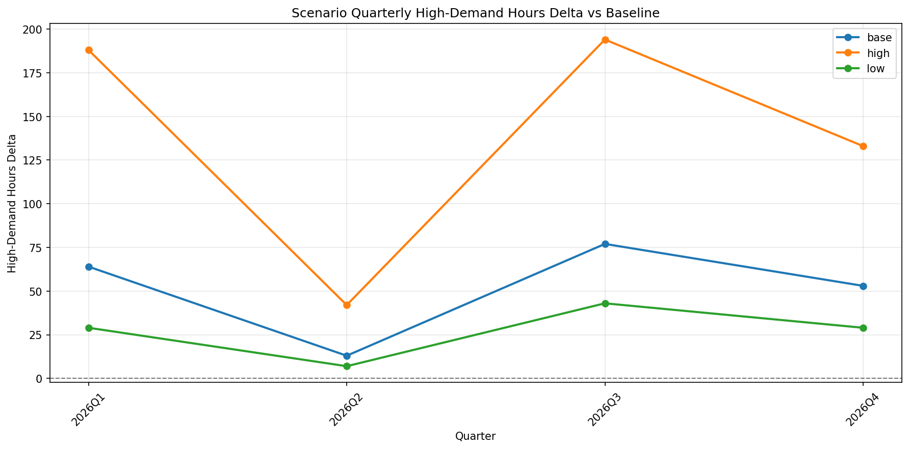

# Ontario Grid Strain Scenario Engine

This tool forecasts Ontario electricity demand using weather and seasonality, then adds AI/data center load scenarios to see how grid stress changes. It's a planning-oriented forecasting tool, not an operator-grade power systems simulator.

We use IESO demand data and ECCC Toronto Pearson weather from 2019-2025 to train models, then forecast 2026 (and optionally 2027) with different AI load scenarios. Outputs include backtest results, scenario tables, figures, and a markdown report.

**What is "grid strain"?** We measure it two ways: quarterly peak demand and the count of "high-demand hours" above a threshold. The threshold is the 95th percentile of training demand. More high-demand hours means more time the grid is under stress.

**Note on 2026 forecasts**: They're synthetic for now. We build the 2026 calendar from 2024's seasonal profile since we don't have real 2026 weather yet. Once we get actual 2026 weather, we can rerun with real data.

**THIS IS AN ACTIVELY UPDATED REPO**: I'm looking to factor in power flow, transmission constraints and generation capacity in further commits, look for updates early next year.

## Definitions

See [docs/GLOSSARY.md](docs/GLOSSARY.md) for full definitions. Quick reference:

**MW**: Megawatts. Ontario demand is total provincial load. Market demand is what's actually traded.

**Train/Val/Test split**: 2019-2023 is training, 2024 is validation, 2025 is test. We never look at future data when training.

**95th percentile threshold**: The demand level that 95% of training hours stayed below. We use this to count "high-demand hours" in forecasts. It's a simple way to flag stress periods.

**MAE**: Mean absolute error. Average prediction error in MW.

**RMSE**: Root mean squared error. Penalizes big errors more than MAE.

**Monthly Peak MAE**: How wrong we are on the highest demand hour of each month. Useful for planning since peaks matter most.

**High-demand hours**: Hours where demand exceeds the 95th percentile threshold. More of these means more stress.

**HDD/CDD**: Heating degree days and cooling degree days. HDD is how much colder it is than 18°C (heating load). CDD is how much hotter (cooling load). Base temp is 18°C.

**Lag1 / Lag24 / Lag168**: Previous hour, same hour yesterday, same hour last week. Demand has strong patterns.

**Rolling mean**: Average of recent hours. We use 24h and 168h rolling means as features.

**SeasonalNaive168**: Baseline that just predicts "same hour last week". Simple but often works.

**LinearWeatherRidge**: Ridge regression with weather features (HDD/CDD) and time features (hour, day of week, etc). Includes a trend term.

**LagRidge**: Ridge regression using lag features (previous hour, yesterday, last week, rolling means).

**MLPRegressor**: Neural network from scikit-learn. Best model so far.

## What the forecasts are telling us

The neural network gets test RMSE around 376 MW. That's about 1.5% error on typical demand.

Scenarios add MW on top of baseline forecasts. Low adds 200 MW, base adds 350 MW, high adds 800 MW. These are flat across the year for now.

Example from 2026: Baseline Q1 peak might be 21,300 MW with 113 high-demand hours. Low scenario adds 200 MW (21,500 MW peak, +29 high hours). Base adds 350 MW (21,650 MW peak, +64 high hours). High adds 800 MW (22,100 MW peak, +188 high hours).

For planning, you care about two things: peak uplift (how much higher the max gets) and how many more hours cross the threshold. Both matter. Peak tells you if you need more capacity. High-hours tells you how often you'll be stressed.

## 2026 Grid Strain Outlook (Scenario-Based)

This section frames what our model outputs suggest for 2026 under different AI/data center load scenarios. It's based on the 2019-2025 demand structure and our scenario engine. This is qualitative framing using scenario deltas, not a real grid simulation or a promise.

**What we're measuring**: "High-demand hours" are hours where demand exceeds 19,431 MW (the 95th percentile of 2019-2023 training demand). This threshold flags stress periods. More hours above it means more operational pressure.

**Important note**: The 2026 baseline is synthetic. We built it from 2024's seasonal profile as a placeholder to validate scenario mechanics. Once we plug in real 2026 weather, the baseline will change, but the scenario deltas (how much AI load adds) should still be informative.

### Demand + Strain (Ontario)

**Base Case** (+350 MW AI load):
- Q1 2026: Peak demand reaches 21,655 MW (baseline 21,305 MW). High-demand hours jump from 113 to 177 (+64 hours). Winter peaks are manageable, but the system spends more time above the stress threshold.
- Q3 2026: Peak demand reaches 23,825 MW (baseline 23,475 MW). High-demand hours increase from 411 to 488 (+77 hours). Summer is already tight, so the absolute increase in high-hours is smaller than Q1, but the total count (488 hours) is high.

**Upside Case** (+800 MW AI load):
- Q1 2026: Peak demand reaches 22,105 MW. High-demand hours jump to 301 (+188 vs baseline). That's a big increase in operational stress.
- Q3 2026: Peak demand reaches 24,275 MW. High-demand hours reach 605 (+194 vs baseline). Summer peaks get pushed higher, and the system spends over 600 hours above the stress threshold in the quarter.

**Downside Case** (+200 MW AI load):
- Q1 2026: Peak demand reaches 21,505 MW. High-demand hours increase to 142 (+29 vs baseline). Smaller uplift, less operational pressure.
- Q3 2026: Peak demand reaches 23,675 MW. High-demand hours increase to 454 (+43 vs baseline). Still adds stress, but more manageable than base or upside cases.

### AI / Data Centre Expansion (What we're modeling)

**Base Case**:
- We model AI/data center load as an additive MW block (flat ramp across the year), not location-specific. It shifts peaks up and pushes more hours above the stress threshold. This is a simplification: real AI load will have daily patterns and might correlate with demand.

**Upside**:
- Faster build-out, higher utilization, or more data centers coming online. Looks like the "high" case (+800 MW). This scenario shows what happens if AI expansion is aggressive.

**Downside**:
- Slower build-out, efficiency gains, demand response programs, or better load management. Looks like the "low" case (+200 MW). This scenario shows what happens if growth is more measured.

### Planning Implications

- **Peak uplift is capacity pressure**: Higher peaks mean you need more generation capacity or imports. The base case adds 350 MW to peaks. Upside adds 800 MW.
- **High-hours uplift is operational pressure**: More hours above the threshold means more time managing tight supply. Base case adds 64-77 hours per quarter. Upside adds 188-194 hours per quarter.
- **Summer (Q3) is where the system looks most sensitive**: Baseline Q3 already has 411 high-demand hours. Even the low scenario pushes it to 454. The high scenario reaches 605 hours, which is a lot of operational stress.

### Important Limitations

- **"Strain" is a proxy**: We measure peak demand and hours above a threshold. This is not power flow analysis, transmission constraint modeling, or generator capacity assessment.
- **AI load is scenario-based**: We add flat MW amounts. Real AI load will have hourly patterns, might correlate with demand (e.g., more cooling load in summer), and will be location-specific (which matters for transmission).
- **2026 baseline is synthetic**: Until we add real 2026 weather, the baseline is a placeholder. Real weather will change the baseline, but scenario deltas should still be informative.
- **No outages, transmission bottlenecks, pricing, or generator constraints**: This is demand forecasting only. Real grid planning needs to account for all of these.

## Charts (what they show + why they matter)

### Model RMSE Comparison



- **What it is**: Bar chart comparing test RMSE across all models
- **Why it matters**: Shows which model is most accurate. Lower RMSE is better
- **What it's saying**: MLPRegressor wins at 376 MW. LagRidge is second at 498 MW. LinearWeatherRidge and SeasonalNaive168 are much worse (1297 MW and 1683 MW). The neural network learns patterns the simple models miss

### Peak Window: Actual vs Predicted (Validation)



- **What it is**: 14-day time series around the highest demand day in validation set. Shows actual vs predicted hour by hour
- **Why it matters**: Peaks are what break grids. If we miss peak timing or magnitude, that's a problem
- **What it's saying**: Model tracks the peak day well. Predictions follow actual demand patterns. Small errors during peak hours, but captures the overall shape

### Peak Window: Actual vs Predicted (Test)



- **What it is**: Same as validation, but for test set (2025 data the model never saw during training)
- **Why it matters**: Test performance is what matters. If it works on test, it should work on 2026
- **What it's saying**: Model still tracks peaks well on unseen data. No major overfitting. Ready for forecasting

### Monthly Peak Scatter (Validation)



- **What it is**: Scatter plot. Each dot is one month's peak demand. X-axis is actual, Y-axis is predicted
- **Why it matters**: Monthly peaks drive capacity planning. If dots are close to the diagonal line, peaks are predicted well
- **What it's saying**: Most dots cluster near the y=x line. Some months are slightly overpredicted (dots above line) or underpredicted (dots below line), but overall the model captures monthly peaks

**How to read scatter plots**: Dots close to the y=x line mean peaks are predicted well. Dots above the line mean overprediction (model says peak is higher than it was). Dots below the line mean underprediction (model says peak is lower than it was)

### Monthly Peak Scatter (Test)



- **What it is**: Same scatter plot for test set (2025)
- **Why it matters**: Shows if monthly peak accuracy holds on new data
- **What it's saying**: Dots still cluster near the line. Model generalizes to new months. Good sign for 2026 forecasts

### Scenario Quarterly Peak



- **What it is**: Bar chart showing peak demand by quarter for each scenario (baseline, low, base, high)
- **Why it matters**: Shows how much peak demand increases under each AI load scenario
- **What it's saying**: 2026 Q1 baseline peak is 21,305 MW. Low adds 200 MW (21,505 MW). Base adds 350 MW (21,655 MW). High adds 800 MW (22,105 MW). Q3 baseline is 23,475 MW, scenarios add the same amounts. Summer peaks (Q3) are already higher, so absolute increases are the same but relative impact is smaller

### Scenario High-Demand Hours Delta



- **What it is**: Bar chart showing how many more hours cross the threshold under each scenario vs baseline
- **Why it matters**: Peak tells you about capacity. High-hours tells you about frequency of stress. Both matter for planning
- **What it's saying**: 2026 Q1 baseline has 113 high-demand hours. Low adds 29 hours (142 total). Base adds 64 hours (177 total). High adds 188 hours (301 total). Q3 baseline has 411 high-hours, scenarios add 43/77/194 hours. Summer already has more high-hours, so the deltas are smaller but absolute counts get high (605 hours in high scenario Q3)

## How to run it

```bash
python -m venv .venv
source .venv/bin/activate
pip install -r requirements.txt
python -m src all --synthetic-year 2026
```

Outputs land in:
- `reports/REPORT.md` - Main report (also [view it here](reports/REPORT.md))
- `reports/figures/*.png` - Plots (tracked in git for README display)
- `artifacts/mlp/*.joblib` - Trained models
- `data/processed/*.parquet` - Clean datasets

**Note on images**: The chart images in this README are tracked in git so they render on GitHub. If images aren't showing, check that:
1. The PNG files are committed (not ignored by .gitignore)
2. Image paths in README use correct relative paths from repo root

## Pre-commit checks

Before committing, make sure you're not staging huge files or generated artifacts:

```bash
# See what's staged
git status
git diff --cached --stat

# Check for problematic files (should return nothing)
git ls-files | grep -E "(\.parquet|data/raw|data/processed|\.venv|\.env)" || true
```

If you accidentally tracked something that should be ignored:

```bash
# Untrack a file (keeps it on disk, just removes from git)
git rm -r --cached <path>
git commit -m "Stop tracking generated data"
```

Common things to untrack: `data/raw/`, `data/processed/`, `artifacts/`, `reports/*.csv`, any `.parquet` files.

**Note**: We DO track `reports/figures/*.png` and `reports/REPORT.md` so they display in the README on GitHub.

## Repo map

- `src/ingest/` - Load IESO demand CSVs and ECCC weather CSVs, clean them, save parquets
- `src/features/` - Merge demand + weather, add HDD/CDD, time features, lags
- `src/models/` - Baseline models (SeasonalNaive, Ridge variants) and neural network
- `src/backtest/` - Evaluate models, compute strain metrics, generate plots and report
- `src/scenarios/` - Apply AI load scenarios to forecasts, compute scenario strain
- `src/pipeline.py` - Orchestrates everything
- `src/main.py` - CLI router

## Limitations

This is a demand + weather proxy. It doesn't model power flow, transmission constraints, or generation capacity. It just says "if demand goes up this much, here's what peak and high-hours look like."

2026 baseline is synthetic. We copy 2024's seasonal pattern. Real 2026 weather will change things.

AI load is scenario-based. We add flat MW amounts. Real AI load will have daily patterns and might correlate with demand.

Doesn't model outages, transmission bottlenecks, or prices. Just demand forecasting.
